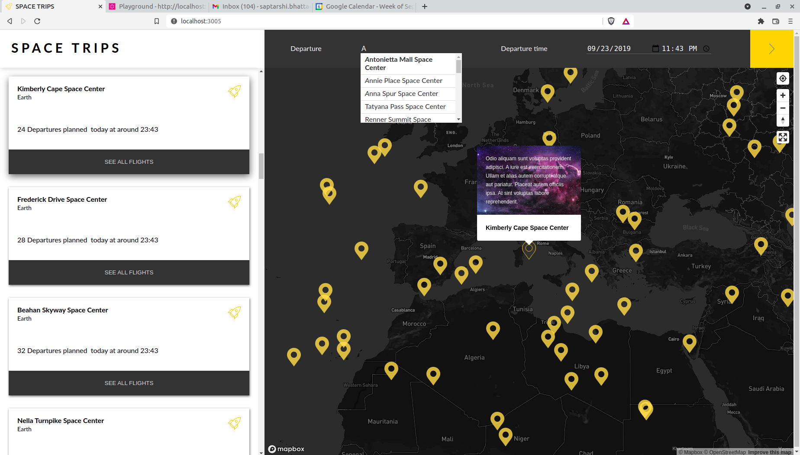

#  Space trips

A responsive web application for viewing space flights from earth.
&nbsp;
&nbsp;
 
&nbsp;
&nbsp;

## Installation instructions
This project was developed with Node18.6.0

* Clone this repo
```sh
git clone https://github.com/Wrishi/spacetrips.git
```
* Navigate to project folder
* To install all dependencies
```sh
npm install
```
* To start the database
```sh
$ docker-compose up -d
```
* Fill up the details in the .env file
```sh
REACT_APP_MAPBOX_TOKEN=<Generated at mapbox website>
REACT_APP_MAPBOX_STYLE=mapbox://styles/mapbox/dark-v8
REACT_APP_SEARCH_INDEX=<Provided by assignment: tips/Algolia.md>
REACT_APP_ALGOLIA_APPID=<Provided by assignment: tips/Algolia.md>
REACT_APP_ALGOLIA_APIKEY=<Provided by assignment: tips/Algolia.md>
REACT_APP_GRAPHQL_ENDPOINT=http://localhost:3000/graphql
REACT_APP_GRAPHQL_APIKEY=API_KEY
```
* Access the search page at http://localhost:3005

## Testing instructions
All tests were written with Cypress. They were tested for 3 browsers: Chromium, Firefox and Electron
* To view test results
```sh
npm test
```
* From the first screen select *Component Testing*
* Choose browser and click on *Start Component Testing in [Chosen Browser]*
* Under *Component specs* click *App.cy.js*

## Trade offs
* Limiting the number of hits makes the application perform better but does not show all markers within boundary
* Increasing it cause decline in responsiveness


## Checklist
### Map Component
- [x] When the user navigates on the map it updates the visible Space centers on the map
- [x] When the user clicks on a marker of the map, the list is scrolled to the selected element and the list item rocket icon bounces for 3s
- [x] When the user clicks on a marker of the map, it shows a popup with the Space center details
- [x] `<GeolocateControl />` must be implemented (related to [react-map-gl](https://visgl.github.io/react-map-gl/))
- [x] `<NavigationControl />` must be implemented (related to [react-map-gl](https://visgl.github.io/react-map-gl/))

### Searchbar Component
- [x] The `<SearchBar />` uses Algolia autocomplete in order to retrieve Space centers
- [x] When a Space center is selected it:
  - [x] centers the map to this selected Space center position
  - [x] scrolls the list to this selected Space center position

### List Component
- [x] When the user hovers a card, it changes the color of the according Space center marker on the map

### Expectations
- [x] At least one pertinent automated test has been written
- [x] [Apollo (graphql)](https://www.apollographql.com/) is used
- [x] [react-map-gl](https://visgl.github.io/react-map-gl/) is used
- [x] A geosearch functionality based on the actual map region is made using [Algolia](https://www.algolia.com/doc/)
- [x] [styled-components](https://styled-components.com/) is used
- [x] A README.md file describing project setup (commands to run, environment variables, etc.) and tradeoffs you have made

### Extra
- [ ] Show list of flights

